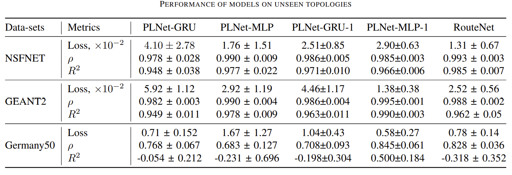

# Path-Link-Graph-Nerural-Network-for-IP-Performance-Prediction
This Repository provides source code for the paper Path-Link Graph Neural Network for IP Network Performance Prediction.

> Kong, Y., Petrov, D., Räisänen, V. and Ilin, A., 2021, May. <cite> Path-Link Graph Neural Network for IP Network Performance Prediction. In 2021 IFIP/IEEE International Symposium on Integrated Network Management (IM) (pp. 170-177). IEEE. </cite>

Paper [[PDF](https://dl.ifip.org/db/conf/im/im2021/211123.pdf)] 

## Performance 

## Improved Scalability

